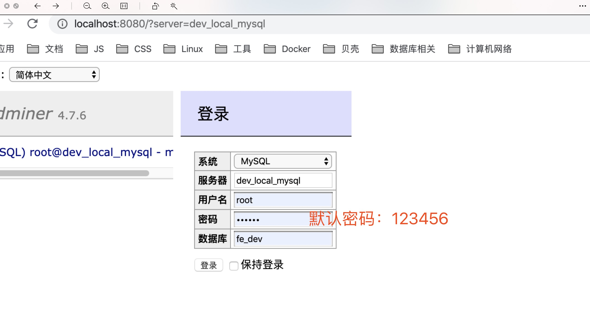
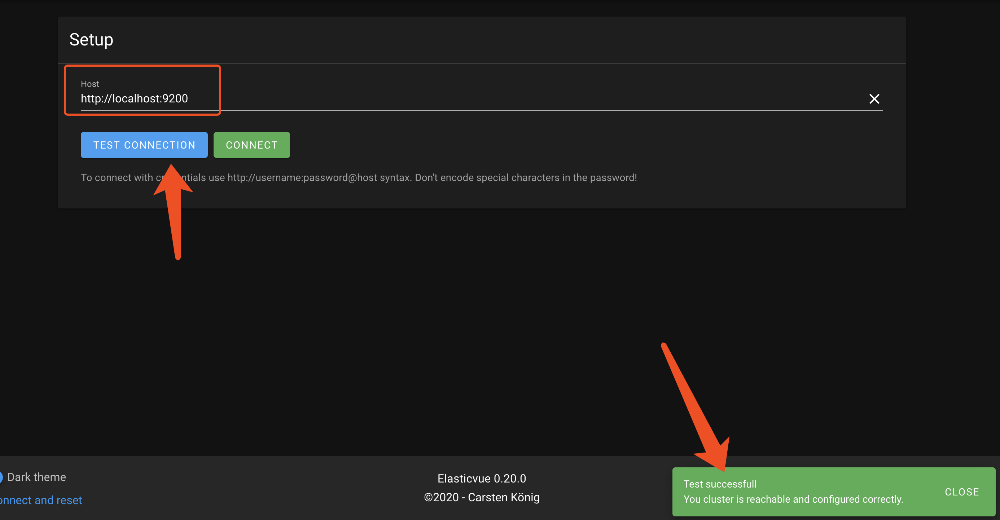
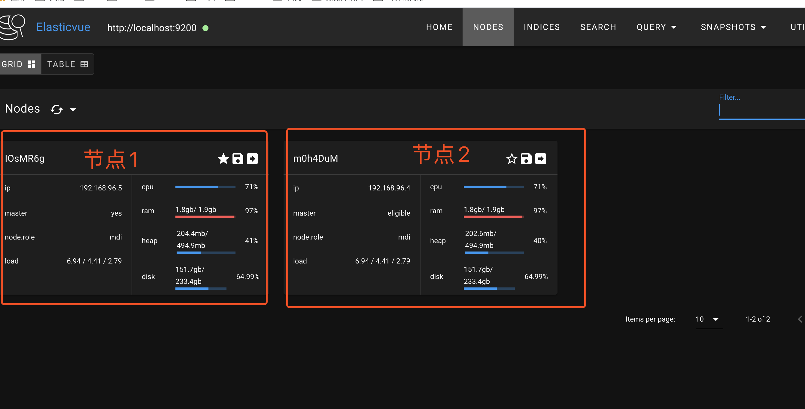
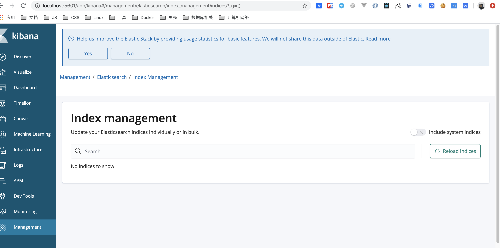

# 基于 Docker 的前端高可用开发环境

## 拉取代码

```bash
  mkdir -p ~/www/fee-docker
  git clone https://github.com/alphawq/Fee-dev-docker.git ~/www/fee-docker
```

# 当前支持环境 & 配置

- 服务地址均为 `127.0.0.1`

```
Redis-4.0              =>      端口号: 6379
Memcache-1.5           =>      端口号: 11211
MongoDB-4.0            =>      端口号: 27017
Adminer-latest         =>      端口号: 8080
MySQL-5.7              =>      端口号: 3306
                                账号: root
                                密码: 123456
                                默认数据库: fe_dev
ElasticSearch-6.6.2    =>      端口号: 9200
Kibana-6.6.2           =>      端口号: 5601
```

## 使用`adminer`管理`mysql`

- 服务器：`dev_local_mysql`
- 用户名： `root`
- 密码：`123456`

  

## 使用插件连接 ES 集群

- [Elasticvue](https://chrome.google.com/webstore/detail/elasticvue/hkedbapjpblbodpgbajblpnlpenaebaa)
  - 测试连接
    
  - 连接成功
    
- [ElasticSearch Head](https://chrome.google.com/webstore/detail/elasticsearch-head/ffmkiejjmecolpfloofpjologoblkegm)

## 使用`Kibana`管理集群

- 服务地址：`127.0.0.1:5601`

  

# 部署

## 安装 Docker

具体安装步骤参见：

- [Mac](https://docs.docker.com/docker-for-mac/install/)
- [Windows](https://docs.docker.com/docker-for-windows/install/)

## 安装成功后，启动服务

- debug 模式启动

  ```bash
  &&  cd ~/www/fee-docker                                     \
  &&  docker-compose build                                    \
  &&  echo '构建成功, 自动启动服务'                              \
  &&  docker-compose up
  ```

- 服务方式启动

  ```bash
  docker-compose -f ~/www/fee-docker/docker-compose.yml up -d
  // 或
  cd ~/www/fee-docker && docker-compose up -d
  ```
